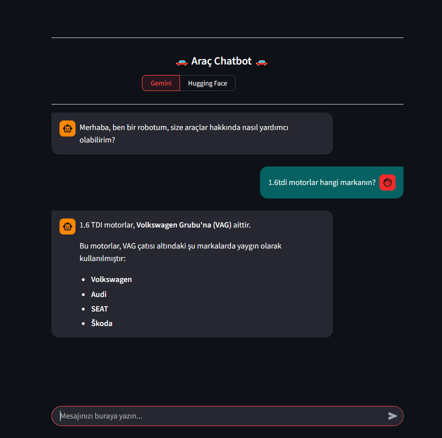

## Vehicles Chatbot - Ai Assistant

Bu proje, Python ve modern Büyük Dil Modelleri (LLM) kullanılarak geliştirilmiş, araçlar hakkında teknik ve genel bilgi sağlayan akıllı bir asistandır. Kullanıcıların tercihine göre farklı yapay zeka modellerinden yanıt alabilmesine olanak tanıyan hibrit bir yapıya sahiptir.

## Öne Çıkan Özellikler

- *Çift Model Desteği:* Kullanıcılar, ihtiyaçlarına göre *Gemini* veya *Hugging Face* modelleri arasında geçiş yapabilirler.
- *Özelleştirilmiş Yanıt Parametreleri:* Hugging Face modellerinde "yaratıcılık" (temperature) seviyesi teknik doğruluk adına düşürülerek, araçlar hakkında daha tutarlı ve bilgi odaklı cevaplar verilmesi sağlanmıştır.
- *Konu Odaklı Asistan:* Sistem, bir araç asistanı mantığıyla optimize edilmiştir.

## Güvenlik ve Geliştirme Yaklaşımı

Projede *Güvenli Kod Geliştirme (Secure Coding)* prensipleri uygulanmıştır:
- *Hassas Veri Yönetimi:* API anahtarları kod içerisine gömülmemiş (hard-coded), .env dosyaları ve ortam değişkenleri (environment variables) kullanılarak sistemden izole edilmiştir.
- *Girdi Doğrulama:* Kullanıcıdan gelen sorguların işlenme sürecinde temel güvenlik kontrolleri ön planda tutulmuştur.


## Gemini seçimi ile Uygulama İçi Görüntü

- Aşağıdaki görselde, asistanın  VAG grubu motorları hakkındaki teknik bir soruya verdiği yanıt görülmektedir:



## Huggingface seçimi ile Uygulama İçi Görüntü

- Aşağıdaki görselde, asistanın VAG grubu motorları hakkındaki teknik bir soruya verdiği yanıt görülmektedir:


##  Kurulum ve Kullanım

1. Bu depoyu klonlayın: git clone https://github.com/oktay-yilmaz28/Python-Vehicles-Chatbot.git
2. Gerekli kütüphaneleri yükleyin: pip install -r requirements.txt
3. .env dosyanızı oluşturun ve API anahtarlarınızı ekleyin:
   ```env
   GEMINI_API_KEY=your_key_here
   HUGGINGFACE_API_KEY=your_key_here
